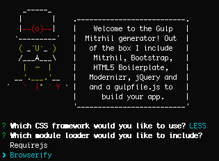

> [Yeoman](http://yeoman.io) generator that scaffolds out a front-end web app using [gulp](http://gulpjs.com/) for the build process and Mitrhil as the MVC framework

## Features

Please see our [gulpfile.js](app/templates/gulpfile.js) for up to date information on what we support.

* Mitrhil MVC framework
* Built-in preview server with livereload
* Automagically compile with either Sass or Less
* Module loading using either Require or Browserify

*For more information on what this generator can do for you, take a look at the [gulp plugins](app/templates/_package.json) used in our `package.json`.*

## Getting Started

- Install: `npm install -g generator-gulp-mithril`
- Run: `yo gulp-mithril`
- Run `gulp build` for building to the `dist` directory and `gulp` for previewing with live reload

## Contributing

1. Fork it
2. Create your feature branch (`git checkout -b my-new-feature`)
3. Commit your changes (`git commit -am 'Add some feature'`)
4. Push to the branch (`git push origin my-new-feature`)
5. Create new Pull Request

## License

(The MIT License)

Copyright (c) 2015 isekivacenz &lt;stevenisekimartin@gmail.com&gt;

Permission is hereby granted, free of charge, to any person obtaining
a copy of this software and associated documentation files (the
'Software'), to deal in the Software without restriction, including
without limitation the rights to use, copy, modify, merge, publish,
distribute, sublicense, and/or sell copies of the Software, and to
permit persons to whom the Software is furnished to do so, subject to
the following conditions:

The above copyright notice and this permission notice shall be
included in all copies or substantial portions of the Software.

THE SOFTWARE IS PROVIDED 'AS IS', WITHOUT WARRANTY OF ANY KIND,
EXPRESS OR IMPLIED, INCLUDING BUT NOT LIMITED TO THE WARRANTIES OF
MERCHANTABILITY, FITNESS FOR A PARTICULAR PURPOSE AND NONINFRINGEMENT.
IN NO EVENT SHALL THE AUTHORS OR COPYRIGHT HOLDERS BE LIABLE FOR ANY
CLAIM, DAMAGES OR OTHER LIABILITY, WHETHER IN AN ACTION OF CONTRACT,
TORT OR OTHERWISE, ARISING FROM, OUT OF OR IN CONNECTION WITH THE
SOFTWARE OR THE USE OR OTHER DEALINGS IN THE SOFTWARE.
